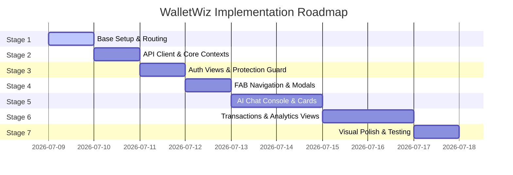

# 🗺️ WalletWiz Frontend Implementation Plan

This staged implementation plan serves as the blueprint for building the **WalletWiz** client application. We will proceed step-by-step, ensuring each stage is fully functional and validated before moving to the next.

---

## 🏁 Stage-by-Stage Implementation Roadmap

---

## 📦 Stage 1: Environment & Base Routing Setup
* **Goals:** Configure dependencies, set up the routing architecture, and create the baseline PWA app shell.
* **Tasks:**
  1. Install required dependencies: `npm install tailwindcss @tailwindcss/vite react-router-dom lucide-react`.
  2. Configure `vite.config.js` to include the `@tailwindcss/vite` plugin.
  3. Initialize `src/index.css` with `@import "tailwindcss"`, Custom Google Fonts (`Outfit`), and base mobile shell styling.
  4. Setup React Router in `src/main.jsx` with routes:
     * `/login` (Authentication)
     * `/` (AI Chat Console / Landing Page)
     * `/analytics` (Dashboard Overview)
     * `/transactions` (History & Management)
  5. Build `src/App.jsx` to render the root `AppShell` container.

---

## 🔑 Stage 2: Core State & Services
* **Goals:** Wire up API configurations and core state contexts for authentication and styling.
* **Tasks:**
  1. Create `src/services/api.js`:
     * Configure base URL using environment variables (`VITE_API_URL`).
     * Set up auth header interceptors.
     * Handle `401` logout triggers and `429` rate-limit errors.
  2. Implement `src/context/ThemeContext.jsx`:
     * Detect system dark/light preferences.
     * Manage root-level `.dark` class toggles.
  3. Implement `src/context/AuthContext.jsx`:
     * Decode JWT tokens on startup to resume sessions.
     * Persist tokens to localStorage (7-day duration).
     * Connect Register/Login/Google auth APIs to context state.

---

## 🔒 Stage 3: Authentication Views & Protected Routes
* **Goals:** Restrict application entry to logged-in users only.
* **Tasks:**
  1. Create the `ProtectedRoute` wrapper component:
     * Redirects to `/login` if `isAuthenticated` is false.
  2. Build the `Login` / `Register` forms in `src/pages/Auth.jsx`:
     * Dual-card transition with email, password, first name inputs.
     * Styled Google Sign-In button component.
  3. Build a global `Toast` or Banner notification component to show error messages (e.g. invalid credentials, rate limit warnings).

---

## 🧭 Stage 4: Floating Action Button (FAB) & Manual Entry Modal
* **Goals:** Build the primary floating navigation console and transaction creation modal.
* **Tasks:**
  1. Build the floating menu button (`src/components/FABNavigation.jsx`) pinned to the bottom:
     * Floating toggle button centered on the bottom nav panel.
     * Radial overlay or slide-up grid showing: Chat, Analytics, Transactions, Add Expense, Theme Switch, and Log Out.
  2. Implement the **Add Expense Modal**:
     * Input fields: Amount, Merchant, Date, Description, Category, Payment Method.
     * Strict Category dropdown (`Food & Dining`, `Shopping`, `Travel & Transport`, `Bills & Utilities`, `Entertainment`, `Health & Medical`, `Others`).
     * Strict Payment Method dropdown (`Cash`, `Card`, `UPI`).
     * Perform local form validation (amount $> 0$, merchant name required).

---

## 💬 Stage 5: AI Chat Console & Interactive Cards
* **Goals:** Implement the conversational main view with real-time API integrations and rich inline components.
* **Tasks:**
  1. Implement `src/context/ChatContext.jsx` to manage chat message history memory.
  2. Build `/` Chat console view (`src/pages/Chat.jsx`):
     * Scrollable conversation timeline + fixed bottom input bar.
     * Typing indicators and error fallbacks.
  3. Build **Inline Renderers** inside chat bubbles:
     * If the AI logs an expense (returns `tool_triggered: "log_transaction"`): Render a rich transaction card detailing the log, complete with "Edit" / "Delete" buttons.
     * If the AI queries stats: Render summary figures or mini charts directly within the bubble.

---

## 📊 Stage 6: Transactions Management & Analytics Views
* **Goals:** Create structured views for data viewing and full-screen visualization.
* **Tasks:**
  1. Implement `src/context/TransactionContext.jsx` to handle listing, filters, and CRUD execution.
  2. Build `/transactions` page (`src/pages/Transactions.jsx`):
     * Tabular format list with paginated pages.
     * Filter inputs: date pickers, category dropdown, payment method dropdown.
     * Inline delete prompts and edit modals.
  3. Build `/analytics` dashboard page (`src/pages/Analytics.jsx`):
     * Timeframe toggle tabs (`this-month`, `last-30-days`, `this-year`).
     * Financial statistics summary cards.
     * Category distribution Donut chart + Payment method progress bars.
     * Daily spending trend Area/Line chart.

---

## 🎨 Stage 7: Visual Polish & Testing
* **Goals:** Polish UX interactions, configure responsive layouts, and test endpoints.
* **Tasks:**
  1. Refine desktop mockups: Ensure the phone container shell feels premium with subtle border styling, status bars, and shadows.
  2. Add entry/exit CSS animations for modals and page transitions.
  3. End-to-end testing with local FastAPI server running. Verify 429 rate limit triggers toast notification.
